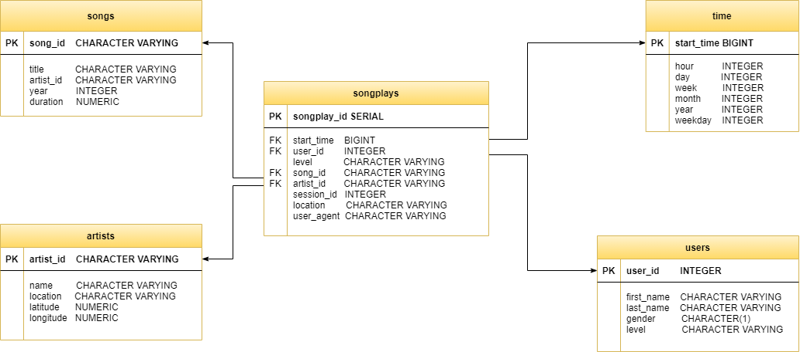

### Sparkify ETL Pipeline  Project

#### 1. Project summary 

The purpose of this project is to create a DB schema and an ETL pipeline in Python to support the song play analysis in Sparkify. 

#### 2. Project organization 

- *Data*  
Data folder has two types of data both in JSON format. One is song dataset, in which each JSON file contains all relevant info for a song; the other is log data consisting of logs file in JSON which records the user's song play activities.

- *create_tables.py*
Drops and creates the tables. Please run this file to reset your tables before each time runing ETL scripts.

- *etl.ipynb*  
Reads and processes a single file from song_data and log_data and loads the data into the tables. This notebook contains detailed instructions on the ETL process for each of the tables.

- *etl.py* 
Reads and processes files from song_data and log_data and loads them into the tables. 

- *sql_queries.py*
Contains all the sql queries, and is imported into the last three files above.

- *test.ipynb*
Displays the first few rows of each table to check the database

- *readme.md*
Provides instructions and discussion for the project.

#### 3. Schema design

Considering all the data features, a star schema will be suffient to meet the query optimization requirement of the song play analysis. It will be constisted of 1 fact table and 4 dimension tables. Please see the ER diagram below:

**Fact Table**
- songplays - records in log data associated with song plays

**Dimension Tables**
- users - users in the app 
- songs - songs in music database 
- artists - artists in music database 
- time - timestamps of records in songplays broken down into specific units 

#### 4. ETL design 

ETL pipeline is mainly consisted of two functions **process_song_file** and **process_log_file**. and the main function will set up a DB connection and start to loop through all the JSON files in song dataset and logs dataset to fetch the data and loads the data into the tables.

#### 5. How to run 

- Open a terminal from the Launcher in Udacity Project Worksapce
- Run Python create_tables.py
- Run Python etl.py
- Open test.ipynb to run all the queries to test the tables
